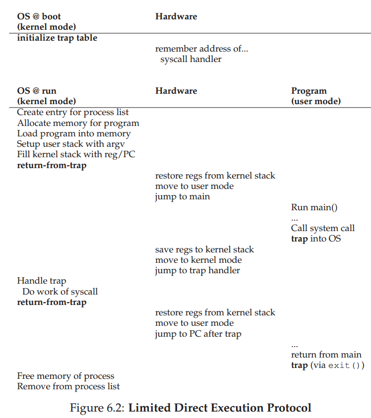
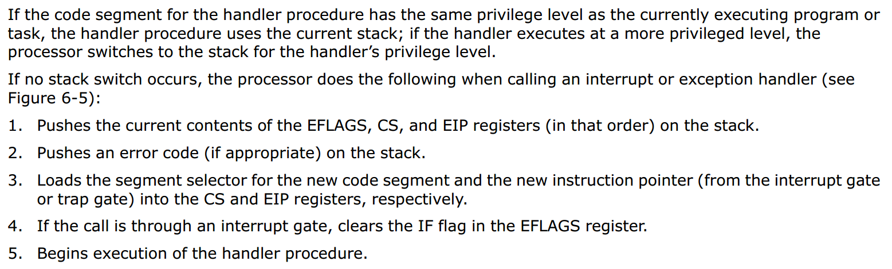
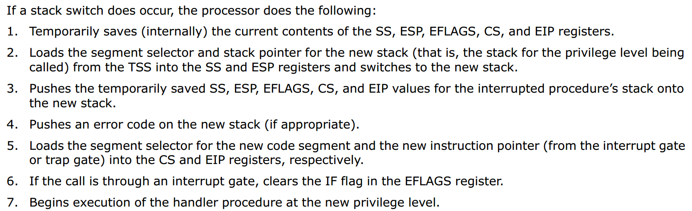
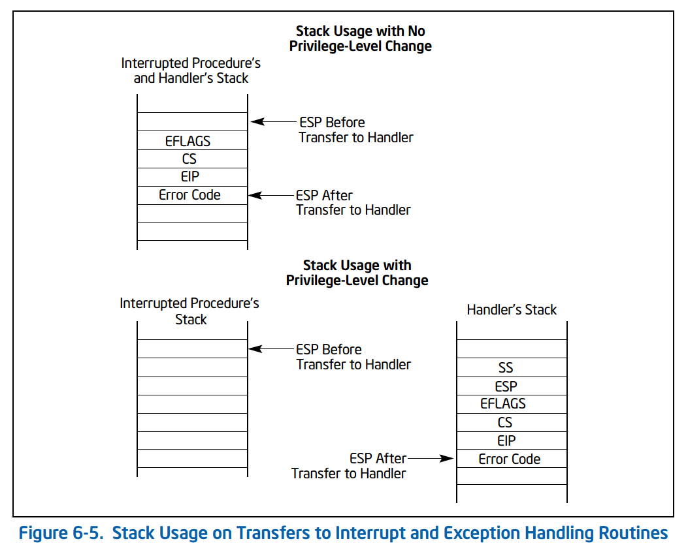
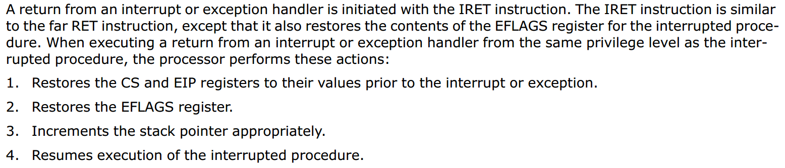
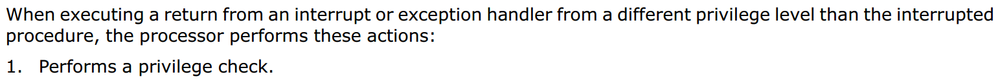
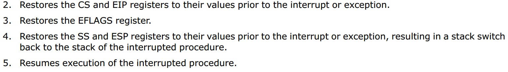
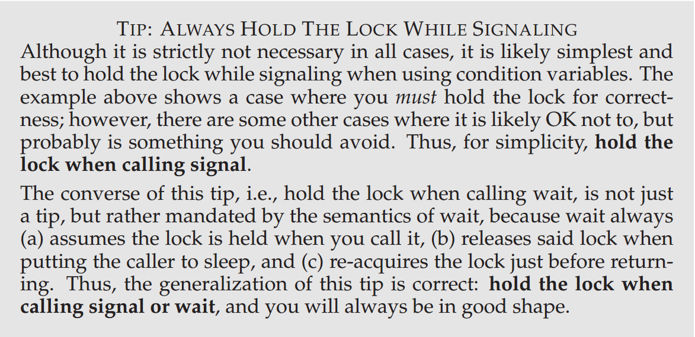

# [Operating Systems: Three Easy Pieces](http://pages.cs.wisc.edu/~remzi/OSTEP/#book-chapters)

### To Students

> Ideas are not pulled out of the air.

《Intel 64 and IA-32 Architectures Software Developers Manual》 以下简称 *IA32*

> 这本书每章的 summary 的 `ASIDE` 基本就是这一章的内容了   
> 感觉这本有点简单了，之前听别人说挺不错的。

- [I. Virtualization](#i)
  - [4. The Abstraction: The Process](#4)
  - [7-10. Scheduling](#7-10)
  - [13. The Abstraction: Address Spaces](#13)
  - [15. Mechanism: Address Translation](#15)
  - [16. Segmentation](#16)
  - 
- [II. Concurrency](#ii)
  - [30. Condition Variables](#30)
- [III. Persistence](#iii)
  - 

&nbsp;   

## I. Virtualization

### 4. The Abstraction: The Process

- Virtualize CPU
  - low-level mechanisms to implement proecss
  - high-level policies to schedule

&nbsp;   

#### 关于 contect swtich

参考 *IA32 §6.4.1*

### 7-10. Scheduling

trade-off：**turnaround time** 和 **response time**

- FIFO
- Shortest Job First (turnaround time)
- Preemptive Shortest Job First （有新来的可以换）
- Round Robin（都可以响应）
- Multi-level Feedback Queue
  - 混合方法
  - 进程被分配到队列（可能会被移动），队列内部使用某种调度算法
  - 对所有队列使用调度（可以按优先级分配时间），被选中的队列在内部执行调度
  - 需要比较合适的优先级改变算法，否则所有进程的对待方式都差不多
- Lottery Scheduling (Tickets)
- Completely Fair Scheduling（公平的虚拟运行时间）
- O(1) Scheduling
- BFS Scheduling

#### Multi-Core Scheduling

cache coherence, cache affinity

### 13. The Abstraction: Address Spaces

早期 OS 为了实现 time-sharing，给一个 process 整个地址空间，切换时将所有状态和数据保存到 disk。这样太慢，因此在切换时将 process 留在 memory，这样多个 proces 同时驻留在内存，于是面临一个问题：isolation 和 protection

OS 为每个 process 提供一段连续内存，仿佛 process 占有整个内存，把这种 abstraction 称作 address space

### 15. Mechanism: Address Translation

> In virtualizing memory, the hardware will interpose on each memory access, and translate each virtual address issued by the process to a physical address where the desired information is actually stored.

hardware 在每个 memory access 时做如下 address translation   
检查 virtual addr < limit register，然后计算 physical addr = base register + virtual addr   
OS 负责为每个 process 设置正确的 base register 和 limit register

### 16. Segmentation

分段为了解决内部碎片，因为分配固定大小的 limit register 导致浪费。

把 code, stack, heap 分开，每个作为单独的一段，有自己的 base register 和 limit register

### 

### 

&nbsp;   

## II. Concurrency

### 30. Condition Variables

这个其实很奇怪，我研究了一下，博客写在这里：[探究 “条件变量signal时是否需要持有mutex”](https://blog.csdn.net/rsy56640/article/details/84953204)

>尤其是参考最后《Programming with POSIX Threads》作者的论坛讨论

&nbsp;   

- Mesa semantics：被 wakeup 的线程有可能在 mutex 队列上阻塞
- Hoare semantics：被 wakeup 的线程立即拿到 mutex 并执行

>[Monitors and Condition Variables - Monitors Semantics](https://cseweb.ucsd.edu/classes/sp16/cse120-a/applications/ln/lecture9.html)

#### 由于大多数系统实现使用 Mesa semantics，所以总是使用 while-loop 来判断 cv 的 wait 条件

&nbsp;   
考虑生产者-消费者模型，要使用 **2** 个条件变量，因为生产者不应该唤醒另一个生产者，消费者也不应该唤醒另一个消费者。（若只有生产者会产生阻塞，可以仅使用 **1** 个条件变量）

&nbsp;   
signal 通常表示**资源可用**；而 broadcast 通常表示**状态改变**。由于有时线程 wait 的需求不相同（例如：请求内存大小），因此 signal 所唤醒的线程有可能仍然不满足 wait 条件，所以调用 broadcast，但是会产生惊群效应。（也可以手动在应用层管理调度）

&nbsp;   

## III. Persistence

